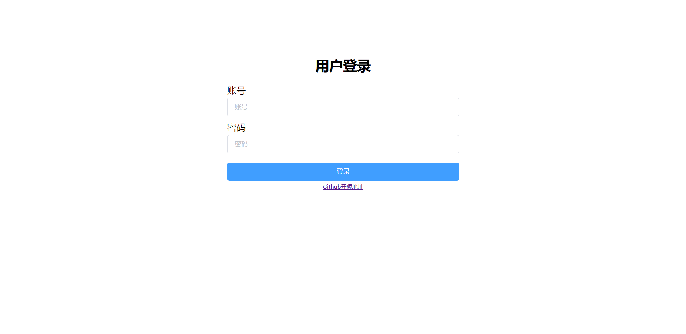
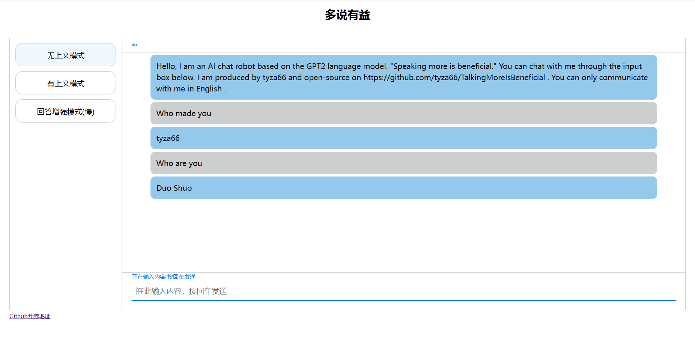
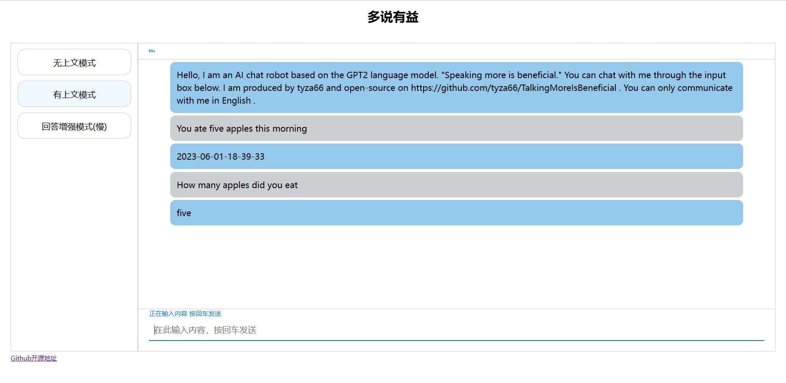

# TalkingMoreIsBeneficial
### 多说有益

基于GPT2语言模型的Java+Python的AI聊天机器人。

登录界面

无上文聊天

有上文聊天

##### 简述

- 尝试使用新的Solon2.3.2生态搭建Web项目，连接操作数据库，调用python后端提供的API实现调用GPT2语言模型进行聊天
- 实现登录功能，账号和密码来自数据库中
- 实现网页在线聊天，可了解上文
- 聊天机器人不可联网只是在本地根据上下文知识库进行回答
- 前端使用非前后端分离的vue搭建
- Solon与Mysql交互中间件使用Wood
- 使用Sa-Token鉴权
- 模板引擎使用Thymeleaf
- 切换模式的时候会清空上下文记忆
- 问句不会被记录在上文中

##### 使用技术

- Python后端：Transformers、Fastapi、Vicorn
- Java后端：Solon、Solon-web、Lombok、Httputils、Hutool、Wood、Sa-Token、Thymeleaf
- 前端：Vue2.0、ElementUI、Axios

##### 端口

- Python后端接口是8000
- Java后端的端口是8080

##### 本地复现

1. 拉取代码
2. 运行Python后端（拉取模型库可能需要较大内存和好的网络环境，一次拉取之后就可以脱机工作了）
3. 运行Java后端
4. 访问localhost:8080开始体验

By：tyza66(洮羱芝闇)